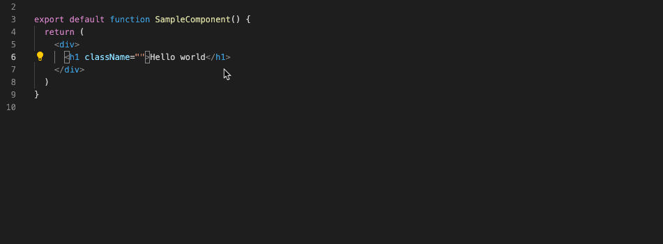
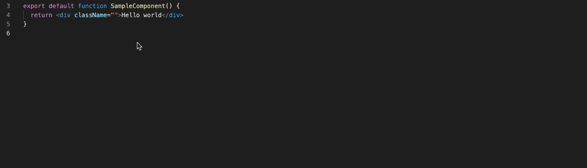
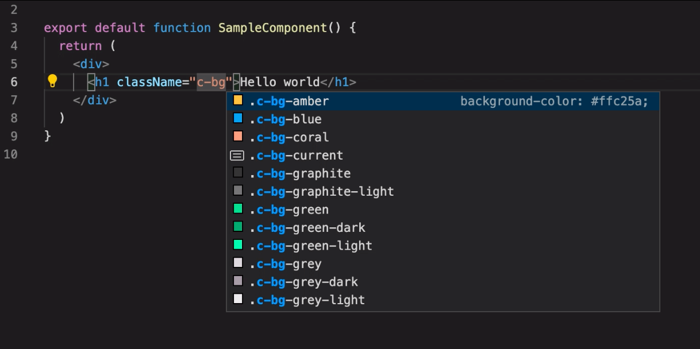
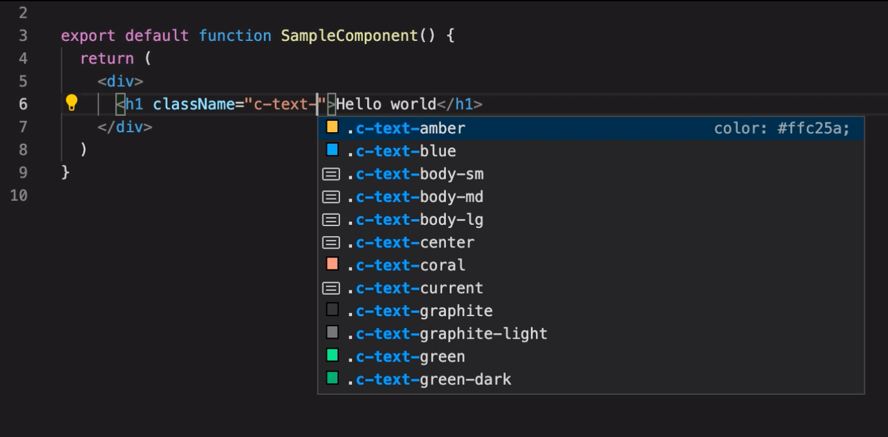
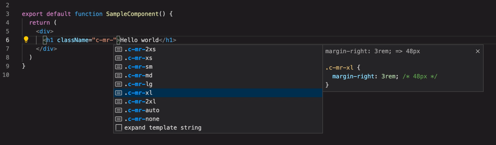
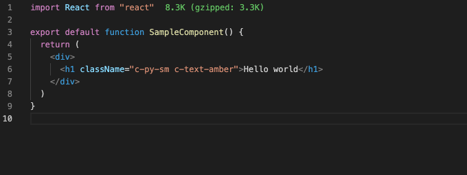

# CSS Classes Completion

CSS classes completion based on a CSS utilities file.

Compatible with a TailwindCSS generated file.

# Useage

Given a CSS utilities file, the extension will parse the css classes to provide completion and documentation in a class list context.

# Supported Files

The following file extensions are supported:
- html
- js
- ts
- tsx
- haml

## Features

### Class Completion

Class completion will be triggered when encountering the `-` char in a "class list" context.
You can force to display the completion list hitting `ctrl + space`



### Reverse Completion (searching classname from css property)

You can search for an utility class by typing the matching css property.



### Color Preview

Atomic classes setting a text color or a background-color will get a color preview embedded in their completion making it easy to select the correct one.

 

### REM To PX Convertion

This extension will automatically convert `rem` to `px` values as extra documentation comments.
The convertion will be done using the `root font-size in pixel` setting value (default: 16)



### Hover Documentation

Mouse over an utility class will display the related css property values applied.



## Installation

Please, configure the extension settings then reload your IDE

### Extension Settings

- CSS file pathes: the relative path to your CSS utilities file. Depending your projects, your file could be at differents places. You can defined multiples pathes separating them with a `,`

  ```
  Example:

  node_modules/my-module-name/my-css-file.css
  ```

- Class prefix: If your utility classes contains a prefix, please define it there (separator included)
  Example: with classes like `c-mr-sm`, `c-rounded`, prefix should be `c-`

- Root font-size in pixel: Font-size in pixel of your body document (default: 16px). It will be used to convert rem values to px
  
- Extra white space: to add an extra white space on completion validation

### Make It Work With TailwindCSS

This extension is designed to work with a list of css classes defined in a css file in your workspace (can be imported from a node dependency aka `node_modules` folder).
It won't look for and parse an existing TailwindCSS configuration file.

If your TailwindCSS configuration file is in the same project that the one you want this extension to work on, the official extension may be the one you're looking for.

If you want to use this extension for its features or whatever reason, you need to generate the TailwindCSS result file every time you change your TailwindCSS configuration file and configure the correct `CSS file paths` setting